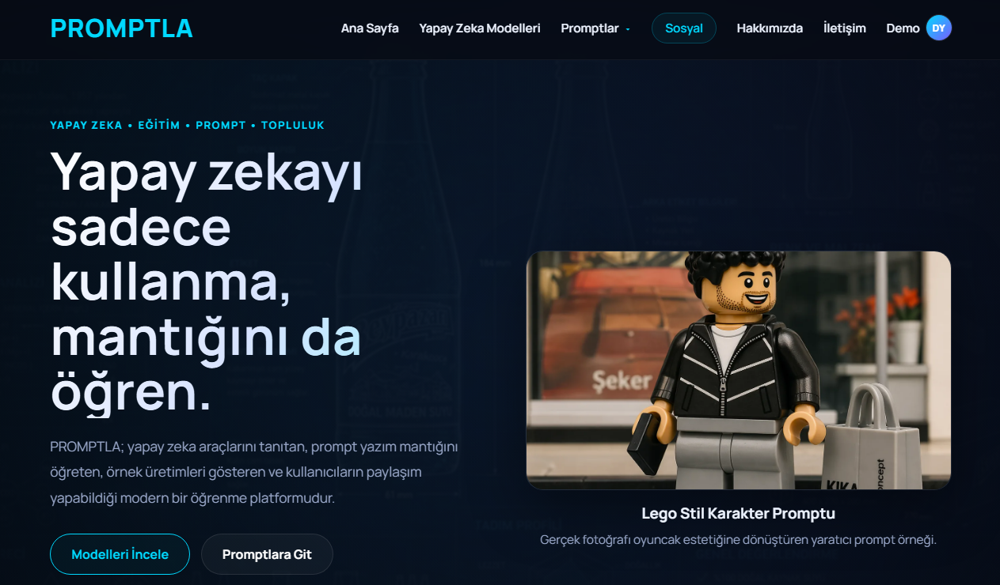
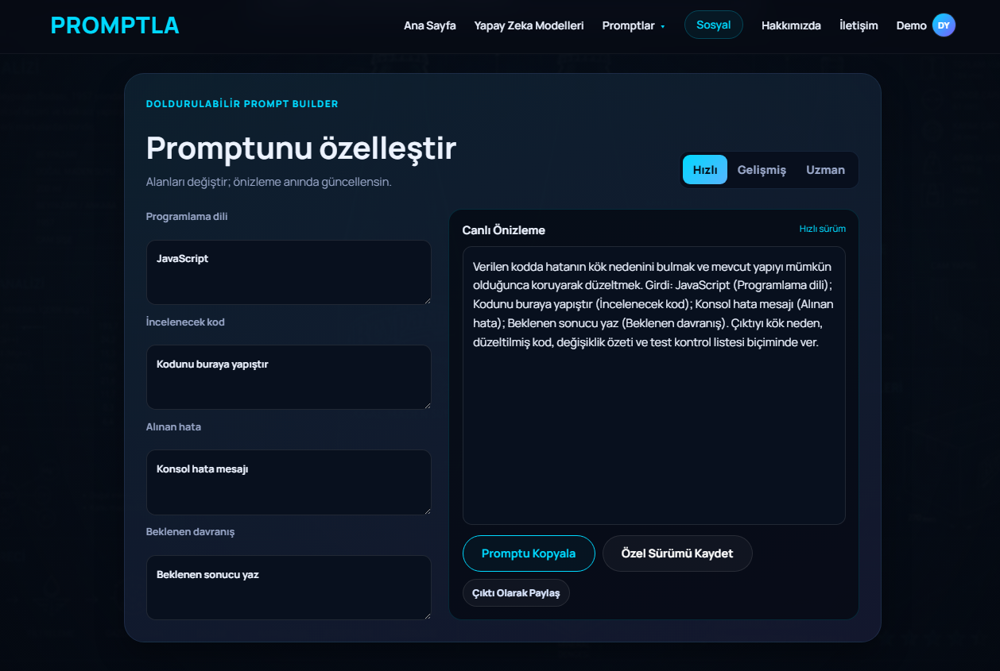
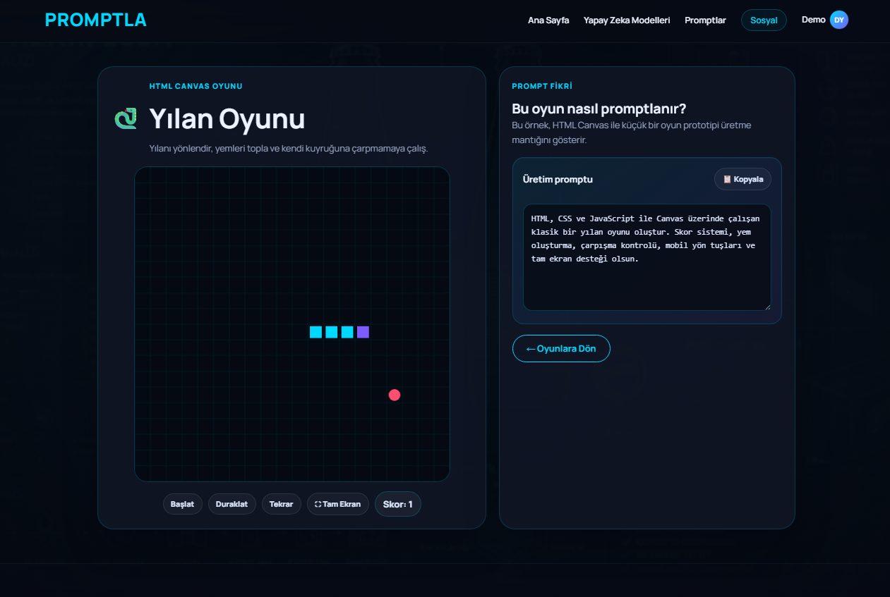

# PROMPTLA

Yapay zekâ araçlarını tanıtan, etkili prompt yazımını öğreten ve kullanıcıların örnek içerikler üzerinden pratik yapmasını sağlayan modern bir öğrenme platformu.

<p align="center">
  <a href="https://gorkemhc.github.io/promptla/"><strong>Canlı Demoyu Görüntüle</strong></a>
  ·
  <a href="https://github.com/gorkemhc/promptla/issues">Hata Bildir</a>
</p>

---

## Proje Hakkında

PROMPTLA; yapay zekâ modellerini yalnızca tanıtmakla kalmayıp kullanıcıların doğru ve etkili prompt yazma mantığını öğrenmesini hedefleyen, tamamen statik çalışan bir web projesidir.

Platformda model rehberleri, kategori bazlı prompt kütüphanesi, doldurulabilir Prompt Builder, yerel hesap ve topluluk demoları ile HTML Canvas tabanlı mini oyunlar bulunur.

## Öne Çıkan Özellikler

- Yapay zekâ modelleri için ayrıntılı rehber sayfaları
- Kategori, arama ve filtreleme destekli prompt kütüphanesi
- Canlı önizlemeli, üç seviyeli Prompt Builder
- Prompt kopyalama, kaydetme, koleksiyon ve paylaşım akışları
- Responsive ve mobil uyumlu modern koyu tema
- HTML Canvas tabanlı oynanabilir mini oyunlar
- PHP veya veritabanı gerektirmeyen statik yapı
- GitHub Pages ile ücretsiz yayın desteği

## Kullanılan Teknolojiler


## Ekran Görüntüleri

### Ana Sayfa



### Prompt Builder



### Yılan Oyunu



## Klasör Yapısı

```text
promptla/
├── assets/
│   ├── css/              # Stil dosyaları
│   ├── images/           # Site görselleri ve küçük görseller
│   └── js/               # Uygulama, veri ve oyun betikleri
├── docs/
│   ├── screenshots/      # README ekran görüntüleri
│   └── YAYINLAMA_NOTU.txt
├── games/                # Oyun merkezi ve oynanabilir oyunlar
├── pages/
│   ├── egitim/           # Rehber ve yapay zekâ araştırmaları
│   ├── hesap/            # Giriş, kayıt ve profil
│   ├── kurumsal/         # Hakkımızda ve iletişim
│   ├── modeller/         # Yapay zekâ model rehberleri
│   ├── promptlar/        # Kütüphane, detay, oluşturucu ve koleksiyonlar
│   ├── topluluk/         # Sosyal paylaşım alanı
│   └── yonetim/          # Yerel demo yönetim paneli
├── 404.html              # Özel hata sayfası
├── index.html            # Ana giriş sayfası
├── robots.txt            # Arama motoru yönergeleri
├── sitemap.xml           # Site haritası
└── site.webmanifest      # Web uygulaması bilgileri
```

## Yerel Olarak Çalıştırma

Herhangi bir paket veya sunucu kurulumu zorunlu değildir.

```bash
git clone https://github.com/gorkemhc/promptla.git
cd promptla
```

Ardından kök dizindeki `index.html` dosyasını tarayıcıda açın. Geliştirme sırasında Visual Studio Code **Live Server** eklentisi de kullanılabilir.

## GitHub Pages ile Yayınlama

1. Repo içindeki **Settings** bölümüne girin.
2. Sol menüden **Pages** seçeneğini açın.
3. Kaynak olarak **Deploy from a branch** seçin.
4. Branch alanında `main`, klasör alanında `/(root)` seçin.
5. Kaydedin.

Canlı adres:

**https://gorkemhc.github.io/promptla/**

## Demo Bilgileri

Yerel yönetim panelini incelemek için:

```text
E-posta: admin@promptla.local
Şifre: PromptlaDemo2026!
```

Bu hesap ve diğer kullanıcı verileri yalnızca tarayıcının `localStorage` alanında tutulur.

## Mevcut Sürüm Hakkında

Bu sürüm tamamen statiktir. Giriş, kayıt, yorum, paylaşım ve yönetim işlemleri demo amacıyla tarayıcı tarafında çalışır. Gerçek kullanıcı yönetimi ve kalıcı veri için ileride Firebase veya farklı bir backend servisi bağlanabilir.

## Yol Haritası

- Firebase Authentication ve Firestore entegrasyonu
- Gerçek kullanıcı profilleri ve kalıcı topluluk sistemi
- Gelişmiş arama, filtreleme ve koleksiyon araçları
- Performans, erişilebilirlik ve PWA iyileştirmeleri
- Yeni prompt kategorileri ve oyun örnekleri

## Geliştirici

**Görkem Hiçyılmaz**

- GitHub: [@gorkemhc](https://github.com/gorkemhc)
- Proje deposu: [gorkemhc/promptla](https://github.com/gorkemhc/promptla)

---

Bu proje eğitim, portföy ve kişisel geliştirme amacıyla hazırlanmıştır.
